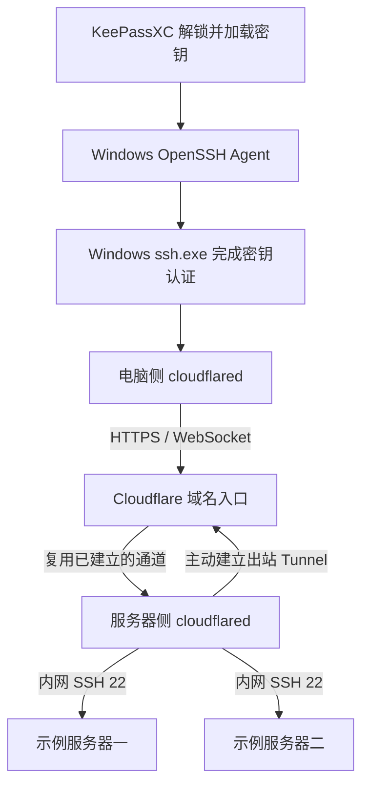

# Cloudflare Tunnel SSH：保留 Windows SSH 与 KeePassXC 的使用习惯

适用环境：Windows 10/11、Windows OpenSSH、KeePassXC，以及已接入 Cloudflare 的域名和 Tunnel。本文沿用已有 SSH 密钥，先验证 Tunnel 登录，再关闭服务器公网 SSH 入站。

相关笔记：[Windows 使用 KeePassXC 与 SSH Agent 管理 SSH 密钥](https://yyq-firefly.pages.dev/posts/50-tutorials/windows/windows-使用-keepassxc-与-ssh-agent-管理-ssh-密钥/)、[Debian SSH 密钥登录排障与安全加固](https://yyq-firefly.pages.dev/posts/50-tutorials/网络与域名/debian-ssh-密钥登录排障与安全加固/)。

## 1. 遇到了什么问题？

一种常见的服务器管理方式是：在 Windows 终端运行 SSH，通过服务器公网地址的 22 端口登录，密钥由 KeePassXC 管理并加载到 Windows OpenSSH Agent。

后来希望关闭服务器公网入站端口，改用 Cloudflare Tunnel 和域名访问。网页服务可以在浏览器里打开，但 SSH 并不会因为有了域名就自动连通。配置时又增加了 `cloudflared.exe` 和一段 SSH 配置，于是产生几个疑问：

- 域名已经有了，为什么电脑还要下载客户端？
- 是否必须放弃 Windows 自带 SSH，或者更换原来的密钥？
- 以后连接服务器是否要先手动打开另一个程序？
- 关闭公网 22 后，SSH 数据究竟从哪里到达服务器？

**这套方案保留 Windows SSH 和原有密钥认证，用 cloudflared 为 SSH 接通经过 Cloudflare 的线路。** 配置完成后，日常仍然从终端执行 SSH 命令。

本文将案例整理为公开教程：两台主机统一使用 `server-1`、`server-2`，域名使用 `example.com`，账号和路径均为示例。请先替换示例值；它们不是已经部署、可直接连接的真实环境。

## 2. 为什么域名不能直接代替客户端？

### 域名负责名字，Tunnel 负责通路

原来的连接方式是：

```text
Windows ssh.exe → 服务器公网地址:22 → 服务器 SSH 服务
```

只把公网地址改成域名，SSH 仍需要能直接连接那个端口。域名本身不会让已经关闭的公网 22 重新可达。

Cloudflare Tunnel 的连接器由服务器侧主动连接 Cloudflare，访问请求通过已经建立的通道返回服务器。连接可以双向传输数据，所以关闭服务器公网入站后，仍可通过该通道提供服务。[Cloudflare Tunnel 原理](https://developers.cloudflare.com/cloudflare-one/networks/connectors/cloudflare-tunnel/)

### SSH 需要适配这条通路

浏览器原本就使用 HTTP/HTTPS；Windows 的普通 SSH 客户端则不会自动把 SSH 数据转换成这个发布入口所需的 WebSocket 连接。

电脑上的 `cloudflared` 负责接通这一段传输，`ssh.exe` 继续核对服务器身份、加密 SSH 内容和完成密钥认证。SSH 通过 `ProxyCommand` 自动调用它。[Cloudflare 的 SSH 客户端配置](https://developers.cloudflare.com/cloudflare-one/networks/connectors/cloudflare-tunnel/use-cases/ssh/ssh-cloudflared-authentication/)

| 组件 | 职责 |
|---|---|
| 域名 | 提供容易记忆的访问名字 |
| Cloudflare Tunnel | 提供服务器主动建立的接入通道 |
| 服务器侧 cloudflared | 维持 Tunnel，并连接内网服务 |
| 电脑侧 cloudflared | 为这次 SSH 会话建立传输通道 |
| Windows ssh.exe | 执行 SSH 协议、检查服务器身份和完成用户认证 |
| KeePassXC + Windows OpenSSH Agent | 管理密钥并提供本机签名能力 |

## 3. 连接过程是什么样的？

以下是一种示例部署：第一台服务器运行连接器，它能访问自身和第二台服务器的内网 SSH。



图中的 Agent 表示认证配合关系，不负责转发网络流量。私钥不需要上传到 Cloudflare；SSH 内容仍由 SSH 协议加密。

文字路径是：

```text
Windows SSH → 本机 cloudflared → Cloudflare
            → 服务器侧连接器 → 目标服务器的内网 SSH
```

关闭的是**服务器公网入站 22**。服务器内部的 SSH 服务和连接器到它的内网访问仍需保留。

服务器侧连接器通常持续运行；电脑侧可使用官方便携客户端，由 SSH 在连接时启动，不必为这种用法安装 Windows 常驻服务。

## 4. 原来的密钥和使用习惯是否改变？

日常仍然是先让 KeePassXC 将对应密钥加载到 Windows OpenSSH Agent，再执行 SSH。

```powershell
# 完成后文配置后，按需连接其中一台。
ssh server-1
ssh server-2
```

进入服务器后用 `exit` 返回本机。正常使用时，不需要先手动双击 `cloudflared.exe`。

KeePassXC 负责管理和加载密钥，Agent 在本机提供签名能力。数据库解锁时是否自动加载、锁定时是否移除，取决于 KeePassXC 的设置。[KeePassXC 文档](https://keepassxc.org/docs/) · [Microsoft：Windows OpenSSH 密钥管理](https://learn.microsoft.com/en-us/windows-server/administration/openssh/openssh_keymanagement)

下面三种资料用途不同：

| 资料 | 证明什么 |
|---|---|
| 用户 SSH 密钥 | 当前用户有权登录目标账号 |
| 服务器主机公钥记录 known_hosts | 对面是预期的服务器 |
| Tunnel 连接器凭据 | 服务器侧连接器有权接入相应 Tunnel |

客户端使用原有 SSH 密钥，不需要为了更换传输通道重新生成密钥，也不需要复制服务器侧 Tunnel 凭据。

## 5. 先理解本文的示例值

| 示例 | 需要替换成什么 |
|---|---|
| `server-1`、`server-2` | 自己希望使用的 SSH 别名 |
| `ssh-1.example.com`、`ssh-2.example.com` | 已配置到相应 Tunnel 的 SSH 域名 |
| `serveruser` | 目标服务器上实际允许密钥登录的用户 |
| `C:\Tools\cloudflared\cloudflared.exe` | 本机 cloudflared 的实际绝对路径 |
| `~/.ssh/config` | 当前用户的 SSH 主配置，Windows 中对应 `%USERPROFILE%\.ssh\config` |
| `~/.ssh/tunnel/config` | 示例中的独立 SSH 配置文件 |
| `~/.ssh/tunnel/known_hosts` | 示例中的可信服务器主机公钥记录文件 |

这里的 `~` 表示当前用户主目录，避免在公开文档中写入具体的 Windows 用户名。`C:\Tools\...` 也是示例安装位置，并非软件强制要求。

以下步骤从“已有可用 Tunnel、域名已接入 Cloudflare、原有 SSH 密钥能登录服务器”开始。

## 6. 如何配置？

### 第一步：确认连接器能到达内网 SSH

在连接器所在的网络中，确认目标服务器的 SSH 地址和端口可达。若连接器运行在 Docker 容器内，容器的 `localhost` 指它自身，不能直接当成宿主机。

内网地址或 DNS 名称应从实际环境取得，不要复制别人的服务器地址。

### 第二步：添加 SSH 域名路由

在 Cloudflare 控制台进入 **Networking → Tunnels**，选择对应 Tunnel，在 **Routes → Add route → Published application** 中添加发布的应用路由，服务类型选择 SSH。例如：

| 域名示例 | 服务目标示意 |
|---|---|
| `ssh-1.example.com` | `ssh://<SERVER_1_PRIVATE_HOSTNAME>:22` |
| `ssh-2.example.com` | `ssh://<SERVER_2_PRIVATE_HOSTNAME>:22` |

表格使用完整 `service` 值说明协议与目标；在控制台已选择 SSH 类型时，地址栏只填写 `<SERVER_1_PRIVATE_HOSTNAME>:22` 这样的主机和端口，不要重复添加 `ssh://`。

尖括号内容是占位符，需要替换。域名应指向 Tunnel 的入口，路由再决定转送到哪个内网 SSH 服务；不能仅添加一个指向源站公网地址的普通 A 记录就认为迁移完成。[官方 SSH 路由步骤](https://developers.cloudflare.com/cloudflare-one/networks/connectors/cloudflare-tunnel/use-cases/ssh/ssh-cloudflared-authentication/)

建议同时为对应 SSH 域名添加 Cloudflare Access **自托管应用**，并设置允许哪些身份访问的策略；这是官方 SSH 路由步骤给出的建议。首次连接或 Access 会话过期时，按策略完成浏览器认证，之后仍须通过服务器的 SSH 密钥认证。两层认证的区别见第 9 节。

### 第三步：下载电脑侧 cloudflared

从 [Cloudflare 官方发布页](https://github.com/cloudflare/cloudflared/releases) 选择适合电脑体系结构的 Windows 客户端。保存到准备使用的程序目录，并核对对应版本资产的 SHA-256。

下面的命令只查看版本和计算文件摘要；需要自行将计算值与官方发布值比较：

```powershell
# 路径为示例，使用前替换。
$cloudflaredExe = 'C:\Tools\cloudflared\cloudflared.exe'
& $cloudflaredExe --version
(Get-FileHash -LiteralPath $cloudflaredExe -Algorithm SHA256).Hash
```

文件摘要用于校验下载内容，不是 SSH 主机密钥。不同版本、不同体系结构的摘要不能混用。

### 第四步：备份主配置，并准备可信主机记录

修改前备份已有的 `~/.ssh/config`，例如保存为同目录下的 `config.before-tunnel.bak`，保留原有其他主机配置。

从已信任的连接或独立可信渠道核对目标服务器的主机公钥，再准备 `~/.ssh/tunnel/known_hosts`。记录中的主机名应对应新的 SSH 域名，例如：

```text
ssh-1.example.com <KEY_TYPE> <TRUSTED_HOST_PUBLIC_KEY_FOR_SERVER_1>
ssh-2.example.com <KEY_TYPE> <TRUSTED_HOST_PUBLIC_KEY_FOR_SERVER_2>
```

这是格式示意，不是有效的公钥记录。密钥类型和内容必须取自核对过的服务器主机公钥；原先按旧地址保存的记录，不一定自动匹配新域名。不要把自己的登录私钥放进这个文件。

### 第五步：添加两台主机的 SSH 配置

将下面的示例保存到 `~/.ssh/tunnel/config`，先替换域名、用户和程序位置：

```sshconfig
Host server-1 ssh-1.example.com
    HostName ssh-1.example.com
    User serveruser
    ProxyCommand "C:/Tools/cloudflared/cloudflared.exe" access ssh --hostname %h
    UserKnownHostsFile "~/.ssh/tunnel/known_hosts"
    StrictHostKeyChecking yes
    PasswordAuthentication no
    KbdInteractiveAuthentication no
    ConnectTimeout 30
    ServerAliveInterval 30
    ServerAliveCountMax 3

Host server-2 ssh-2.example.com
    HostName ssh-2.example.com
    User serveruser
    ProxyCommand "C:/Tools/cloudflared/cloudflared.exe" access ssh --hostname %h
    UserKnownHostsFile "~/.ssh/tunnel/known_hosts"
    StrictHostKeyChecking yes
    PasswordAuthentication no
    KbdInteractiveAuthentication no
    ConnectTimeout 30
    ServerAliveInterval 30
    ServerAliveCountMax 3
```

在主配置 `~/.ssh/config` 的原有 `Host` 或 `Match` 段之前加入：

```sshconfig
Include ~/.ssh/tunnel/config
```

`Include` 让 SSH 自动读取独立文件，因此在任意工作目录都可以使用别名。文件名 `config` 不带 `.txt` 后缀。OpenSSH 对多数配置采用先取得的值，因此将这条 Include 放在已有通配 `Host *` 规则之前，并用第 8 节的 `ssh -G` 检查实际结果。

| 配置 | 作用 |
|---|---|
| `Host` / `HostName` | 将短别名或输入的域名关联到目标域名 |
| `User` | 指定服务器登录用户 |
| `ProxyCommand` | 让 SSH 通过辅助程序收发数据；`%h` 由 SSH 替换为目标主机名 |
| `UserKnownHostsFile` / `StrictHostKeyChecking yes` | 使用已核对的主机记录，拒绝陌生或变化的主机密钥 |
| 两项 `Authentication no` | 禁用密码和键盘交互回退，保留密钥认证 |
| `ConnectTimeout 30` | 设置 SSH 连接及初始握手超时，不代表辅助程序所有步骤都必定在 30 秒结束 |
| 两项 `ServerAlive` | 探测连接是否失效，多次无回应时结束连接 |

SSH 配置有自己的语法；不要把 PowerShell 的 `$env:USERPROFILE` 直接当成所有 SSH 参数都能识别的变量。本文在支持的位置使用 `~`，程序路径使用带引号的绝对路径。[OpenSSH 配置手册](https://man.openbsd.org/ssh_config)

### 第六步：验证新通道，再关闭公网 SSH

先保留可用的维护连接，按第 8 节检查配置，再分别登录两个 Tunnel 入口。确认主机身份正确、原有密钥可用之后，才移除服务器公网 22 的入站放行，保留连接器所需的内网访问。

规则修改后，从外部再次验证：域名 SSH 仍可登录，源站公网 22 已不可直接访问。具体还需检查云安全组、安全列表和主机防火墙中是否存在其他放行规则。

## 7. 配置完成后怎样使用？

```powershell
# 交互登录，按需选择一台。
ssh server-1
ssh server-2

# 执行单条命令并返回本机。
ssh server-1 'uname -m'
ssh server-2 'uptime'

# 完整域名也可匹配示例配置。
ssh ssh-1.example.com
```

Windows OpenSSH 的 `scp`、`sftp` 也可以复用主机配置：

```powershell
sftp server-1

# 上传到远端登录用户的主目录。
scp '.\example.txt' server-1:~/

# 从另一台服务器下载示例文件。
scp server-2:~/example.txt '.\example-from-server-2.txt'
```

这些是示例操作，执行前应确认文件和路径；目标存在同名文件时可能被覆盖。电脑侧 cloudflared 只承载对应 SSH 通道，不会因此接管电脑所有软件的流量。

## 8. 连不上时怎样排查？

### 8.1 确认使用的是预期 SSH 程序

电脑可能同时装有多个 SSH。查看路径，必要时明确调用 Windows 自带版本：

```powershell
Get-Command ssh.exe -All | Select-Object Source
& "$env:WINDIR\System32\OpenSSH\ssh.exe" server-1
```

### 8.2 查看最终生效的配置

下面命令只展开本文配置，不建立 SSH 连接：

```powershell
ssh -G server-1 | Select-String '^(hostname|user|port|proxycommand|userknownhostsfile|stricthostkeychecking) '
ssh -G server-2 | Select-String '^(hostname|user|port|proxycommand|userknownhostsfile|stricthostkeychecking) '
```

应看到替换后的真实域名、登录用户、cloudflared 命令和主机记录文件。若 `hostname` 仍是短别名，优先检查 Include、文件名和当前 SSH 程序。

`port 22` 仍可能出现在展开结果中，这是 SSH 默认配置值。由于存在 `ProxyCommand`，数据传输交给 cloudflared；电脑到 Cloudflare 使用 HTTPS/WebSocket，连接器到源站才使用内网 22。不能据此判断源站公网 22 是否开放，也不需要给日常 SSH 命令添加 `-p 443`。

### 8.3 查看客户端和 Agent 状态

```powershell
# 请改成实际客户端路径。
Test-Path -LiteralPath 'C:\Tools\cloudflared\cloudflared.exe'
Get-Service ssh-agent
ssh-add -l
```

如果 Agent 没有身份，检查 KeePassXC 是否解锁，以及对应条目是否加载到 Windows OpenSSH Agent。不同 Agent 的密钥列表不一定互通。

`ssh-add -l` 不显示私钥，但会显示密钥标识；路径、用户信息和这些标识都不应直接放进公开知识库。

### 8.4 按错误定位

| 现象 | 优先检查 |
|---|---|
| 无法解析短别名，或尝试旧地址 | 主配置、Include、Host 匹配和 SSH 程序路径 |
| 找不到程序、CreateProcess 错误 | cloudflared 是否存在，路径和引号是否正确 |
| `Permission denied (publickey)` | 登录用户、Agent 中的密钥、服务器授权公钥 |
| 主机密钥校验失败 | 核对服务器是否重建、记录是否匹配域名；不要直接关闭校验 |
| WebSocket 错误、403、超时 | 结合日志检查网络、DNS、Cloudflare 路由或 Access 策略、连接器状态 |
| 一台可连，另一台不可连 | 故障主机的 SSH 服务、对应路由和内网路径 |
| 共用连接器的入口同时失效 | 连接器及其所在主机的状态 |

需要更多信息时可运行 `ssh -v server-1`。公开日志前，应移除个人路径、真实域名、账号、地址和密钥标识。

直接在浏览器中打开 SSH 域名，不能代替 SSH 连通性验证；该入口不是普通网页。

## 9. access ssh 是否意味着要邮箱登录？

`cloudflared access ssh` 是客户端子命令名称，不能只根据它判断某个域名是否启用了额外身份策略。

如果为入口配置了 Cloudflare Access，客户端可能按该策略要求浏览器认证；具体方式和会话有效期由策略决定。服务器自身的 SSH 密钥校验是另一层认证。配置了哪一层，就需要满足那一层的要求。

本教程讲解传输和 SSH 客户端配置，不包含任何个人账户的套餐、开通流程或认证策略。

## 10. 换电脑与故障恢复

### 换电脑

准备 Windows OpenSSH、KeePassXC 与对应 Agent 集成；安全迁移所需 SSH 密钥，下载并校验 cloudflared，替换客户端配置中的路径，核对可信主机记录，最后测试连接。

日常 SSH 客户端无需保存云平台管理 API 私钥或服务器侧 Tunnel 凭据。

### 连接器故障

如果两台主机共用一个连接器，连接器所在主机故障会影响两个入口。维护前应准备独立恢复路径，不能停止唯一入口后再依赖同一入口修复它。

没有可用会话时，可先通过云控制台等管理入口检查状态；必要时临时放行受限维护来源的 SSH，修复并验证 Tunnel 后撤销。删除本机配置不会自动恢复服务器公网 22。

### 长时间会话

电脑休眠、网络变化或连接器重连可能中断 SSH，保活配置不能保证会话永久不断。Cloudflare 对这类发布的 SSH 服务使用 WebSocket 转送，并为长时间连接推荐其他 Client-to-Tunnel 方式；有持续长连接需求时应单独评估。[Cloudflare 协议与长连接说明](https://developers.cloudflare.com/cloudflare-one/networks/connectors/cloudflare-tunnel/routing-to-tunnel/protocols/)

## 11. 示例与验证边界

本文的域名、别名、账号、程序位置和文件内容均经过泛化。配置与命令可做语法检查，但示例环境不代表已部署的可用服务。实际验收应包括主机身份、密钥登录、Tunnel 连通性和关闭公网端口后的复测。

- [Cloudflare Tunnel 原理](https://developers.cloudflare.com/cloudflare-one/networks/connectors/cloudflare-tunnel/)
- [Cloudflare：通过 cloudflared 使用 SSH](https://developers.cloudflare.com/cloudflare-one/networks/connectors/cloudflare-tunnel/use-cases/ssh/ssh-cloudflared-authentication/)
- [cloudflared 官方发布](https://github.com/cloudflare/cloudflared/releases)
- [OpenSSH 配置手册](https://man.openbsd.org/ssh_config)
- [Microsoft：Windows OpenSSH 密钥管理](https://learn.microsoft.com/en-us/windows-server/administration/openssh/openssh_keymanagement)
- [KeePassXC 文档](https://keepassxc.org/docs/)
