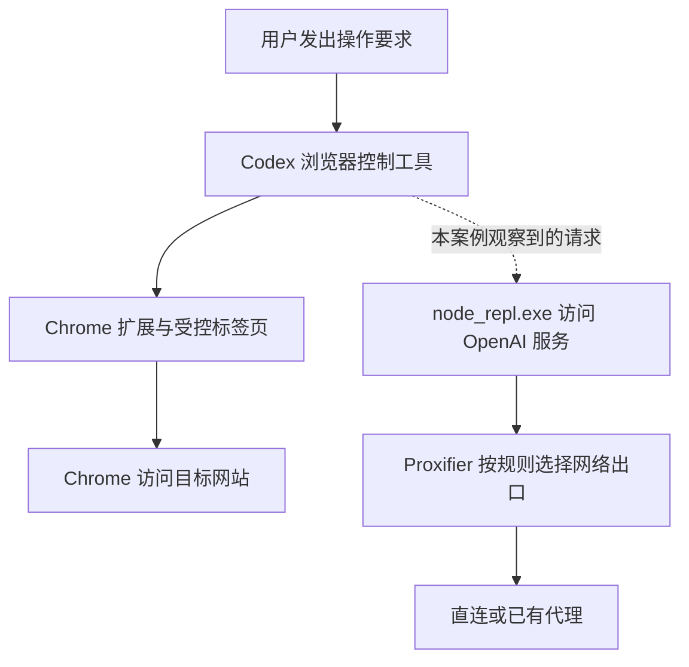

# Proxifier 为什么会影响 Codex 操控 Chrome：问题、原理与修复

适用环境：Windows、Proxifier v4、Codex 桌面端，以及已安装并连接浏览器扩展的 Chrome。开始前应已有可用的本地代理服务；本文处理辅助程序遗漏规则的情况，程序名和域名以读者自己的新日志为准。

相关笔记：[[Codex Claude 软件级代理设置教程]]、[[ChatGPT Windows 升级后 Proxifier 网络异常排查]]。

## 1. 遇到了什么问题？

在一台使用 Proxifier 分流联网的 Windows 电脑上，Chrome 能正常打开网站，也已经登录了需要操作的页面，但让 Codex 控制这个 Chrome 时，始终无法正常取得标签页或操作页面。

当时的现象是：

- Codex 本身能够正常聊天，Chrome 里的网页也能手动访问。
- 重新登录网站、重新安装浏览器扩展后，控制操作仍然失败。
- Proxifier 日志中，Codex 主程序正在走代理，另一个辅助进程访问 OpenAI 服务却反复超时。

需要解决的问题是：**为什么网页和 Codex 都能联网，浏览器控制却不能用？怎样找到真正失败的连接并修复？**

本文根据一次实际故障整理，已将个人路径、配置文件名和代理端口改为示例。示例值不能直接当作读者电脑的实际设置；OpenAI 的公开服务域名和程序名保留用于说明技术原因。

## 2. 为什么控制 Chrome 还会受代理影响？

完成一次浏览器操作需要多个程序配合，联网的程序不只有 Chrome。

Chrome 负责访问网页；Codex 的浏览器控制工具还需要自己的网络连接。在这次故障中，参与工具执行的辅助进程名为 `node_repl.exe`。它发起的请求同样受到 Proxifier 规则影响。

可以把它理解为电视和遥控器：电视能正常播放，不代表遥控器的控制通道也正常。网页打开成功，也不能证明控制工具已经连通。

下面是职责示意图，不是对 OpenAI 内部通信实现的完整描述：



不看图也可以记住两条独立的检查线索：

- **网页访问**：Chrome 能否打开目标网站。
- **控制工具连接**：执行浏览器操作的辅助程序能否连接它需要的服务。

`node_repl.exe` 是本案例日志中观察到的程序名。升级后应以实际日志为准，不要假定所有版本都永远使用同一个辅助程序。

## 3. 怎样定位到 Proxifier 规则遗漏？

Proxifier 会按程序、目标主机和目标端口匹配规则，并按从上到下的顺序处理。因此，只给 `codex.exe` 配置代理，不代表其他辅助程序也自动获得同样的规则。[Proxifier 官方规则说明](https://www.proxifier.com/docs/win-v4/rules.html)

本案例的判断依据是：

| 观察 | 结论 |
|---|---|
| 已登录网页能手动使用，控制操作失败 | 网站登录状态不能解释全部问题 |
| `codex.exe` 使用代理，`node_repl.exe` 访问 `ab.chatgpt.com:443` 等目标时出现 `10060` | 失败请求来自另一个程序，需要检查它命中的规则 |
| 原有应用代理规则没有覆盖这个辅助程序 | 主程序与辅助程序的网络出口可能不同 |
| 添加有明确范围的规则后，标签页读取和页面操作恢复 | 规则遗漏与故障现象、修复结果吻合 |

`10060` 即 Windows Sockets 的 `WSAETIMEDOUT`，表示连接超时。[Microsoft 错误码说明](https://learn.microsoft.com/en-us/windows/win32/winsock/windows-sockets-error-codes-2)

它本身不能证明一定是代理问题，也不能单独证明 DNS、插件或网站有故障；必须结合程序名、目标、命中规则和修复前后的结果判断。

重新登录网站不会修改 Proxifier 规则，重装扩展也不会自动把辅助程序加入代理范围。这解释了为什么前面的操作没有解决该故障。

## 4. 如何修复？

### 4.1 先备份当前配置

先从 Proxifier 窗口标题确认正在使用的配置，通过 **File → Save Profile As** 或 **File → Export Profile** 保留备份，再开始修改。Proxifier v4 会自动保存当前配置中的更改，不能依赖关闭窗口来撤销。下列只是文件命名示例：

```text
%APPDATA%\Proxifier4\Profiles\example.ppx
%APPDATA%\Proxifier4\Profiles\example.before-browser-fix.bak
```

`%APPDATA%` 表示当前用户的应用数据目录，不包含固定的个人用户名。实际配置文件名以 Proxifier 当前加载的文件为准。完整 `.ppx` 可能含代理认证信息，不应随教程公开。[Proxifier 配置文件说明](https://www.proxifier.com/docs/win-v4/profiles.html)

### 4.2 为失败的辅助程序增加一条规则

打开 **Profile → Proxification Rules**，选择 **Add** 新增规则。以下规则演示本案例的修复方式。其中 `1080` 是虚构的示例代理端口，填写时必须使用本机已有 SOCKS5 服务的实际端口。

| 字段 | 示例设置 | 作用 |
|---|---|---|
| Name | `Codex Browser Runtime` | 便于识别这条规则 |
| Enabled | 开启 | 让规则参与匹配 |
| Applications | `node_repl.exe` | 匹配案例中失败的辅助程序 |
| Target hosts | `chatgpt.com;`<br>`*.chatgpt.com;`<br>`openai.com;`<br>`*.openai.com` | 限定到这些公开服务域名及子域名 |
| Target ports | `443` | 匹配目标服务的 HTTPS 端口 |
| Action | 已有 SOCKS5，例如 `127.0.0.1:1080` | 使用电脑上已经配置好的代理 |
| 相关顺序 | `Localhost` → 新规则 → 原有应用规则 | 本地通信先直连，再检查外部请求 |

这里有两个不同端口：`443` 是要访问的目标服务端口；`1080` 是示例中的本机代理入口。`127.0.0.1` 是回环地址，表示本机，不是服务器公网地址。

程序、目标主机和端口三个条件需要同时满足；规则中的裸域名与 `*.` 子域名分别列出。域名列表只覆盖本案例需要处理的目标，遇到其他失败请求时先看新日志，再决定是否扩展。

填写规则时按程序名匹配，不要使用日志中的 PID。PID 是进程启动后分配的编号，下次启动可能改变。如果电脑上存在多个同名程序，可改用辅助程序的完整路径限定范围；路径含空格时加双引号，升级后重新检查路径是否变化。

### 4.3 保留本机通信直连

保持 `Localhost` 规则的 `Direct` 动作，让本机程序之间直接通信。检查新增规则前面是否还有其他规则会抢先匹配同一连接。[Localhost 与规则顺序](https://www.proxifier.com/docs/win-v4/rules.html)

本案例只新增处理该程序、域名和端口组合的规则，并未把所有程序都改成代理。对原配置与备份的比较也确认了修改范围。

### 4.4 保存并加载配置

在界面中确认规则修改后，当前配置会自动保存；核对窗口标题，确认 Proxifier 使用的是修改后的配置。若从外部编辑或导入文件，可以用官方支持的命令行方式加载：

```powershell
# 示例路径：先改成实际程序位置和已经保存的配置文件。
$proxifierExe = 'C:\Tools\Proxifier\Proxifier.exe'
$profileFile = Join-Path $env:APPDATA 'Proxifier4\Profiles\example.ppx'
& $proxifierExe $profileFile silent-load
```

`silent-load` 表示加载时不再弹出确认；它不会禁用日志，也不表示隐藏网络流量。已有规则正常时，不需要日常重复执行这个命令。[官方命令行说明](https://www.proxifier.com/docs/win-v4/profiles.html)

### 4.5 用实际浏览器操作验收

重新发起一次操作，并查看这次新产生的日志：

1. 能否取得目标 Chrome 的标签页列表。
2. 能否读取已经登录的页面。
3. 能否执行获准的页面操作，并看到结果变化。
4. 辅助程序是否命中预期规则，新的连接是否仍然超时。

本案例在修复后完成了标签页读取和页面操作验证。单独看到规则已保存、Codex 能聊天或网站能打开，都不足以代替这组检查。

## 5. 修好后平时怎么用？

保持原有代理服务和 Proxifier 正常运行。在 Codex 中选择 `@Chrome`，并使用安装了扩展、已经登录网站的那个 Chrome Profile。

例如：

```text
@Chrome 读取我已经登录的当前网页，并说明页面上有哪些可用操作。
```

可以在应用的 Computer Use / 计算机使用设置中检查浏览器连接和网站权限。具体菜单以当前版本为准。[OpenAI 浏览器扩展说明](https://learn.chatgpt.com/docs/chrome-extension)

`@Browser` 所指的内置浏览器与日常 Chrome 使用不同的浏览器 Profile，不会自动共享已有标签页和登录会话。需要沿用 Chrome 已有登录状态时，选择安装了扩展的对应 Chrome Profile。[OpenAI 内置浏览器说明](https://learn.chatgpt.com/docs/browser)

## 6. 下次出问题，按什么顺序检查？

| 现象 | 优先检查 |
|---|---|
| 能聊天、能开网页，但取不到 Chrome 标签页 | Proxifier 新日志里的失败程序、目标和命中规则 |
| 辅助程序没有走预期代理 | 规则是否启用，顺序、程序名、域名、端口是否匹配 |
| 规则命中后仍超时 | 本地代理是否运行、实际端口是否一致、上游连接是否可用 |
| Chrome 能控制，网站却要求重新登录 | 网站会话和当前 Chrome Profile |
| 能读页面，某个操作被拒绝 | 对应网站或浏览器扩展的操作权限 |
| 网络正常，扩展仍不连接 | 按官方排错流程检查 Profile、扩展状态和应用版本 |

排查日志时看新请求，不要把仍保留在窗口中的旧红色记录当成修复失败。分享日志前，只保留必要的程序名、公开目标域名、端口、命中规则和错误类型，遮蔽账户、私人网址和带令牌的参数。

## 7. 适用范围与参考资料

本案例说明的是辅助进程被代理规则遗漏的一类故障，不代表所有浏览器控制故障都由 Proxifier 引起。程序名、目标域名、界面和代理端口发生变化时，需要根据新证据重新判断。

如需撤销这项修改，可先禁用新增规则并观察结果；整份恢复旧配置会同时回退之后的其他改动，操作前应比较差异。

- [Proxifier：规则匹配与 Localhost](https://www.proxifier.com/docs/win-v4/rules.html)
- [Proxifier：配置文件与 silent-load](https://www.proxifier.com/docs/win-v4/profiles.html)
- [OpenAI：浏览器扩展设置与排错](https://learn.chatgpt.com/docs/chrome-extension)
- [OpenAI：内置浏览器与 Profile](https://learn.chatgpt.com/docs/browser)
- [Microsoft：Windows Sockets 错误码](https://learn.microsoft.com/en-us/windows/win32/winsock/windows-sockets-error-codes-2)
